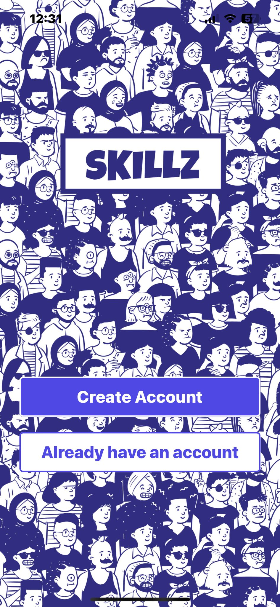
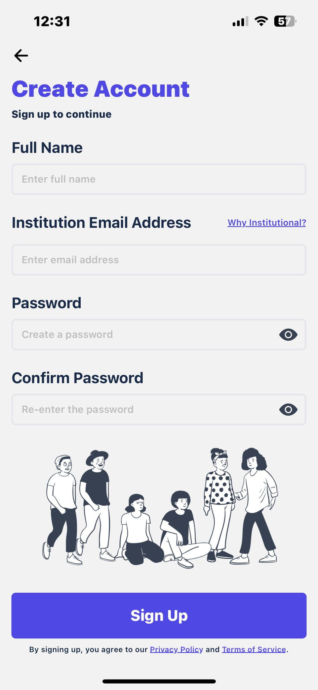
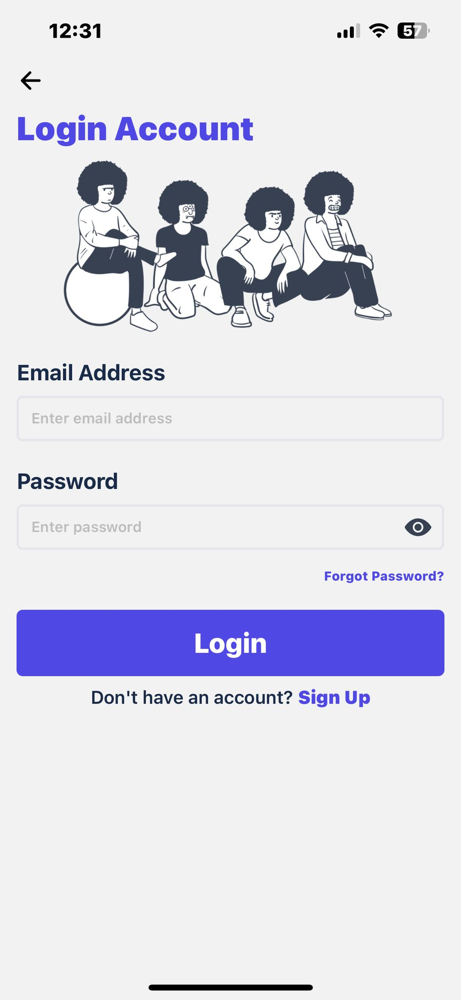
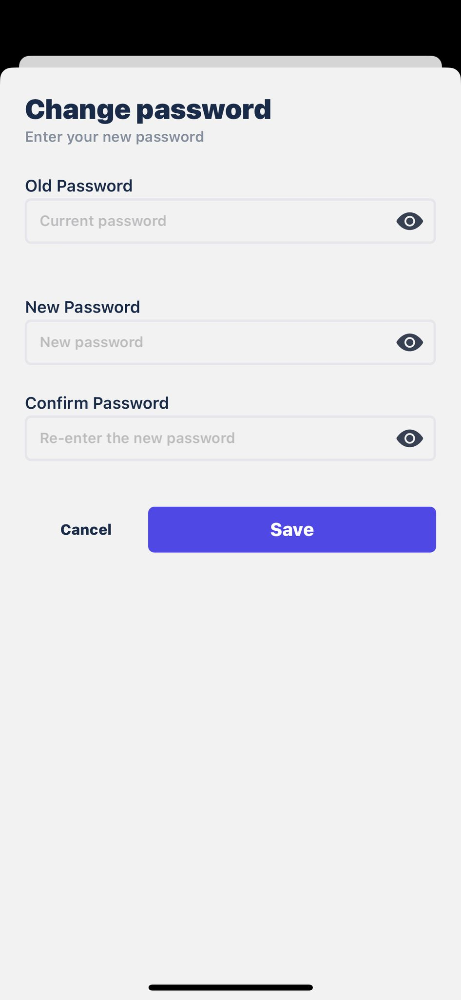
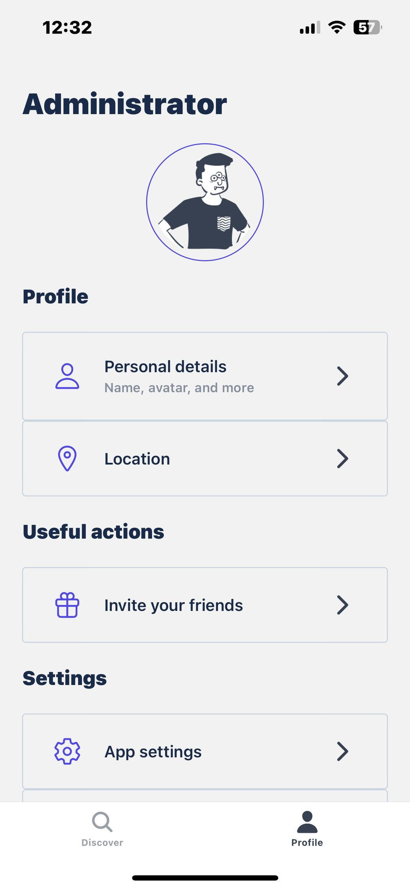
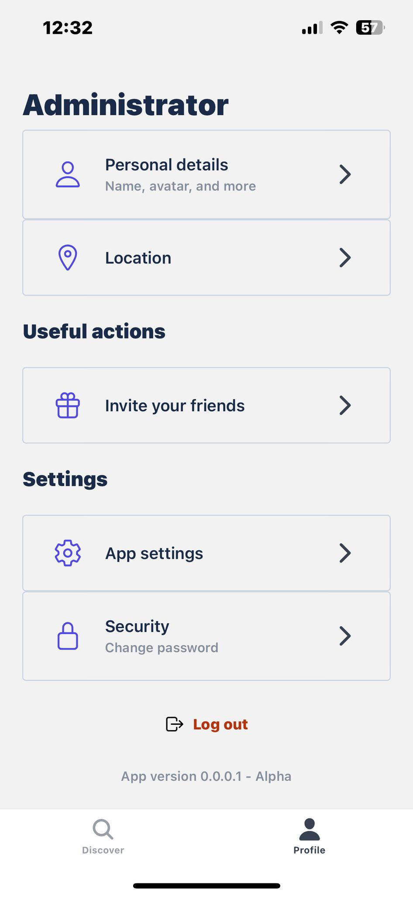
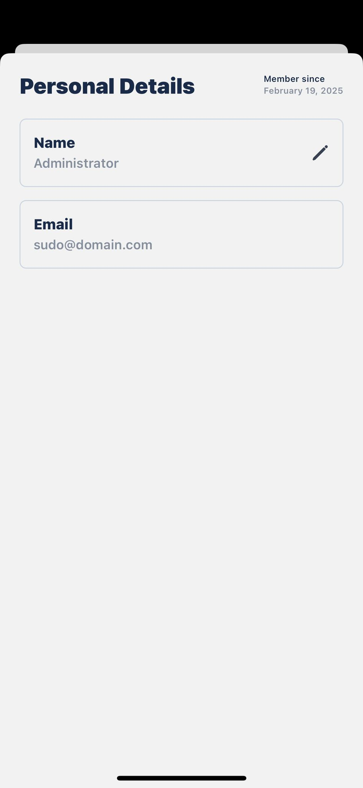
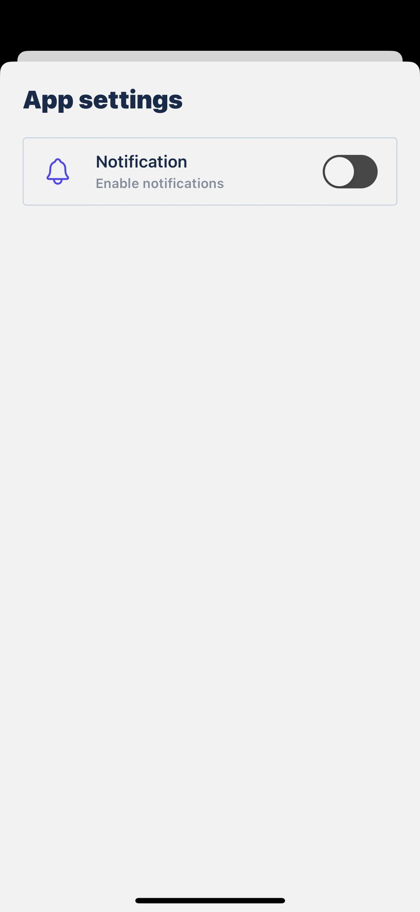
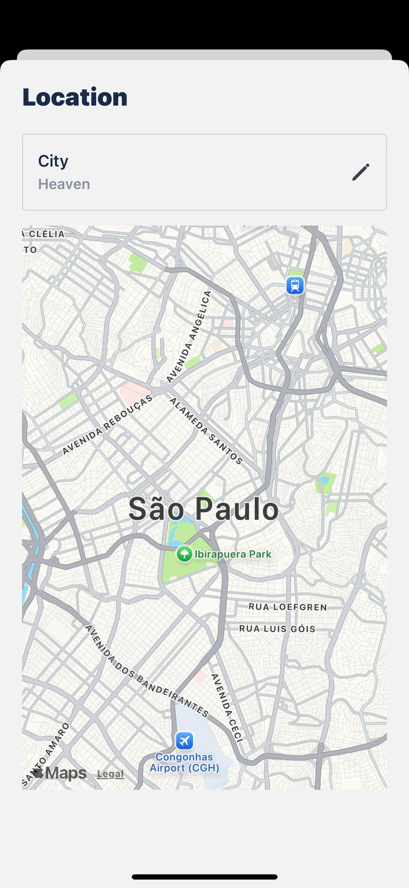

# My First React Native APP 📱

Explore my journey of building my first React Native application, where I leverage my existing skills in React and Tailwind CSS to create a mobile experience focused on authentication and profile switching.

## Project Overview

This project marks my first venture into the world of React Native development. Drawing from my experience with React and Tailwind CSS in Next.js, I aimed to build a functional mobile app centered around authentication and profile management. The goal was to apply my existing knowledge while navigating the unique challenges of mobile development.

## Why React Native & Tailwind?

Having worked extensively with React and Tailwind CSS in Next.js projects, I chose React Native to leverage my existing skillset and speed up the development process. React Native's cross-platform capabilities allow me to reuse my CSS skills through Nativewind, making styling easier and more efficient.

## Project Structure: Organization & Decisions

The project follows a modular structure to ensure maintainability and scalability. Here's an overview of the key directories:

```
client-skl/
├── api/                  # API Request Handling
├── app/                  # Main Application Entry Point
├── assets/               # Static Assets (Images, Fonts)
├── components/           # Reusable UI Components
├── context/              # Global State Management (if applicable)
├── guard/                # Authentication Guard
├── hooks/                # Custom React Hooks
├── lib/                  # Helper Functions/Utilities
├── middlewares/          # Middlewares
├── types/                # TypeScript Definitions
├── .gitignore            # Specifies intentionally untracked files that Git should ignore
├── app-env.d.ts          # Application Environment Variables
├── app.json              # App Configuration
├── babel.config.js       # Babel Configuration
├── cesconfig.json        # CES Configuration
├── global.css            # Global CSS File
├── metro.config.js       # Metro Bundler Configuration
├── nativewind-env.d.ts   # Nativewind Environment
├── package-lock.json     # Dependency Lockfile
├── package.json          # Project Dependencies
├── prettier.config.js    # Prettier Configuration
├── tailwind.config.js    # Tailwind CSS Configuration
├── tsconfig.json         # TypeScript Configuration
└── README.md             # This file!
```

### Key Directories

- **`api`**: Centralized API request functions to improve code organization and reusability.
- **`components`**: Reusable UI elements, following the DRY (Don't Repeat Yourself) principle.
- **`context`**: Manages global state, providing app-wide access to data.
- **`hooks`**: Custom React hooks that encapsulate logic used across components.
- **`types`**: TypeScript type definitions for better type safety.

## Key Learnings

- **State Management**: Gaining a deeper understanding of how to effectively manage app state.
- **React Native Components**: Mastering the core components and their properties.
- **Nativewind**: Utilizing Tailwind CSS for styling React Native components.

## React/Next.js to React Native: Challenges & Solutions

Transitioning from React/Next.js to React Native came with a few challenges:

- **UI Components**: Adapting to React Native's components, which differ significantly from traditional HTML elements.
- **Styling**: Learning how to apply styles effectively using Nativewind.
- **Platform Differences**: Handling the differences between iOS and Android platforms.
- **Navigation**: Implementing navigation between screens.

I overcame these challenges by... *(Here, explain how you solved each of these issues.)*

## Visual Showcase


## Technologies Used

- **React Native**: The core framework for building the app.
- **JavaScript/TypeScript**: The programming languages used.
- **Nativewind**: For styling.

## Future Roadmap

- **Add Unit Tests**: Implement testing for better reliability.
- **Improve UI/UX**: Enhance the user interface and experience.

## Self-Reflection & Critique

This project has been a fantastic learning experience, but there is always room for improvement. Moving forward, I plan to focus on:

- **Testing**: Implementing more comprehensive unit and integration tests.
- **State Management**: Exploring more advanced state management solutions.
- **Accessibility**: Ensuring the app is accessible to all users.

## Visual Showcase

*(Include screenshots or GIFs of your app in action. Here are placeholders for now):*

- **Welcome Page**: 
- **Create Account**: 
- **Login Screen**: 
- **Change Password**: 
- **Profile**: 
- **Profile2**: 
- **Personal Details**: 
- **App Settings**: 
- **Location**: 


